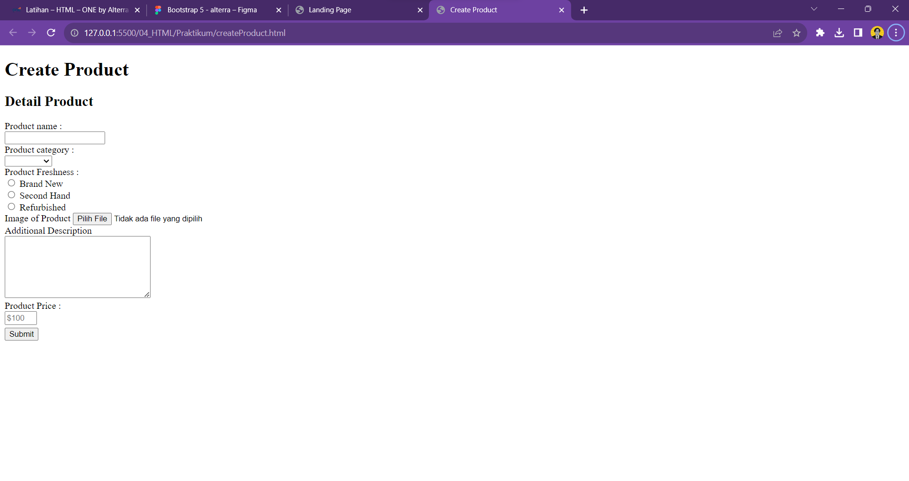
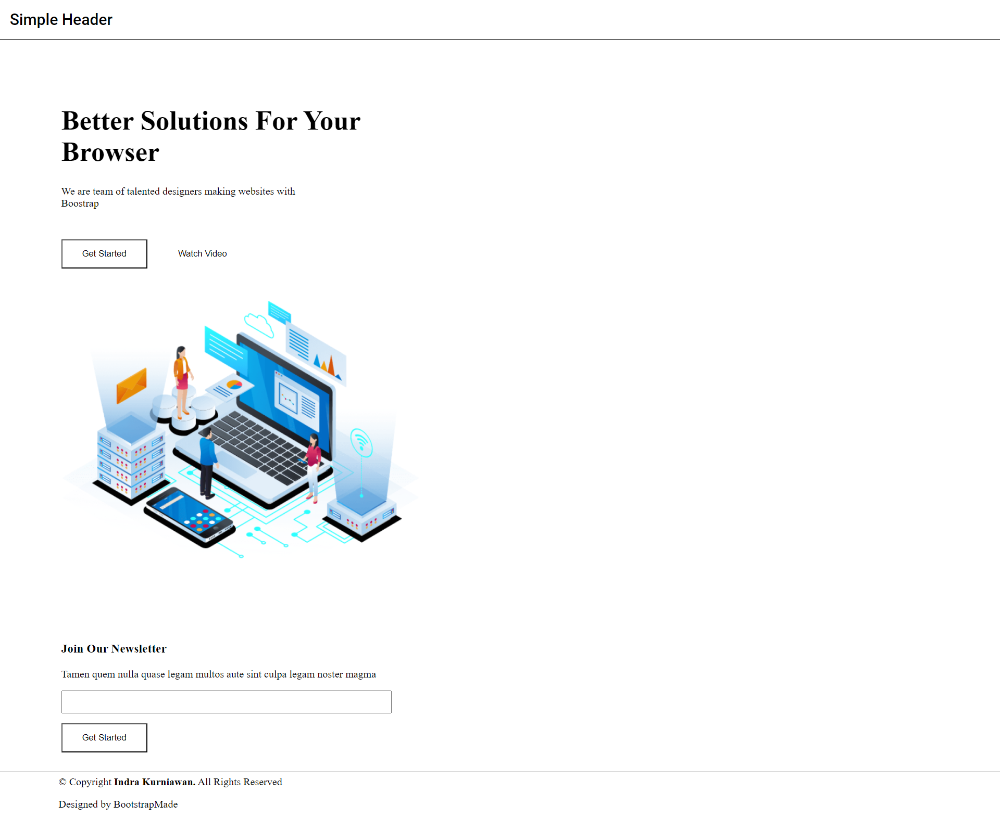
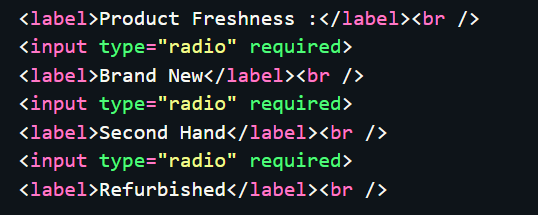
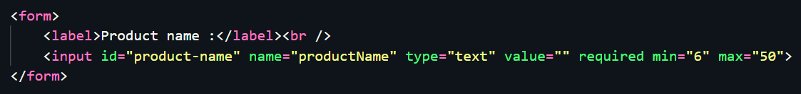
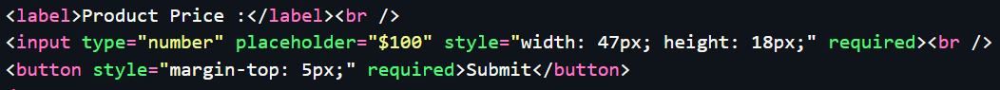
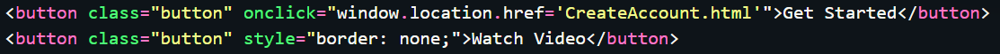

# Resume Kampus Merdeka ReactJS – HTML
# 21 Agustus 2023

## 3 Poin Materi HTML :
### - Apa itu HTML

HTML merupakan singkatan dari Hypertext Markup Language, HTML adalah sebuah standar yang digunakan secara luas untuk menampilkan halaman web.

### - Kegunaan HTML

1. Membuat struktur dari halaman website.
2. Mengatur tampilan dan isi dari halaman web.
3. Membuat tabel dengan tag HTML table.
4. Membuat form HTML.
5. Membuat gambar dengan canvas.
6. Mempublikasikan halaman website secara online.

### - Struktur dasar HTML

1. '<!DOCTYPE html>': Deklarasi tipe dokumen yang menunjukkan bahwa dokumen ini adalah dokumen HTML5.
2. '<html>': Elemen induk yang mengawrap seluruh konten HTML.
3. '<head>': Berisi informasi tentang dokumen, seperti judul dan tautan ke stylesheet atau skrip JavaScript.
4. '<title>': Menetapkan judul dokumen yang akan ditampilkan di bilah judul browser.
5. '<body>': Berisi semua konten yang akan ditampilkan di halaman web.

## Soal Latihan HTML :

### - Soal Prioritas 1

### - Soal Prioritas 2

### - Soal Ekspolorasi
1. Lakukan validasi “required” pada setiap form yang telah dibuat

2. form product Product Name mempunyai minimal 6 huruf dan maksimal 50 huruf ,Product Price harus berupa angka

3. Sambungkan halaman landingPage.html dengan CreateAccount.html sehingga dapat berpindah halaman

