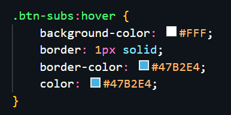
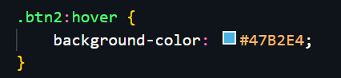
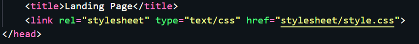
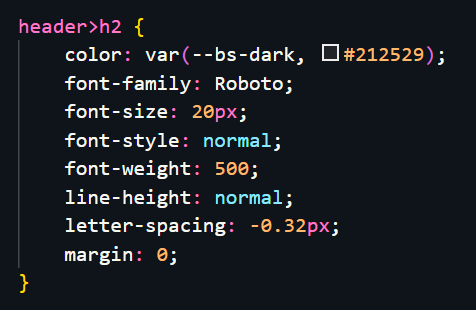
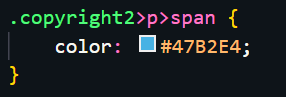
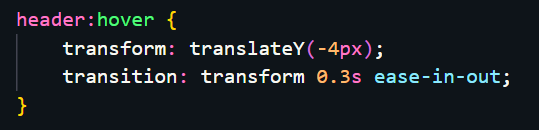
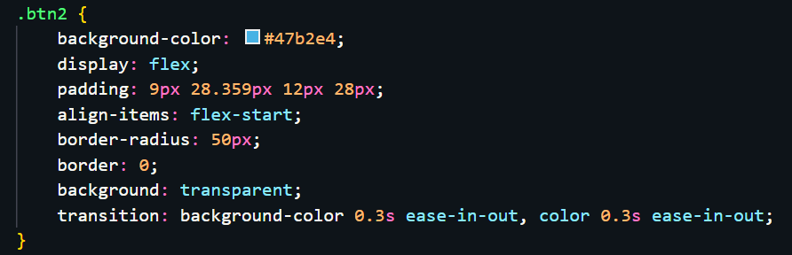

# Resume Kampus Merdeka ReactJS – CSS
## 22 - 23 Agustus 2023

## 3 Poin Materi CSS :
### - Apa itu CSS

CSS atau Cascading Style Sheets adalah bahasa pemrograman yang digunakan untuk mengatur tampilan dan gaya suatu halaman web yang ditulis dalam bahasa markup seperti HTML atau XML. CSS dapat digunakan untuk mengontrol elemen-elemen di dalam halaman web, termasuk warna, ukuran teks, tata letak, margin, padding, jenis font, dan banyak lagi. Dengan menggunakan CSS, Anda dapat membuat halaman web menjadi lebih menarik dan estetis. CSS memisahkan tampilan dari struktur konten, memungkinkan pengembang untuk membuat perubahan pada tampilan halaman secara terpisah dari konten asli.

Analoginya yaitu HTML sebagai rangka tulang, JavaScript merupakan otot, dan CSS sebagai kulitnya.

### - 3 cara menambahkan file CSS ke dalam HTML
- Eksternal CSS

```
< link rel="stylesheet"  href=main. css">
```
*Syntax ini disisipkan ke dalam tag <head> pada HTML. Ekstensi file CSS adalah .css*
- Internal CSS

```
<style>
        body {
             background-color: #19355f;
        }
        h1 {
             color: #f47523;
             margin-left: 40px;
        }
</style>
```
*Syntax ini dapat digunakan di
dalam satu file HTML.
Didefinisikan di dalam elemen <style>, di dalam bagian <head> atau di dalam bagian <body>.*

- Inline CSS

```
<h1 style="color: #19355f;">Hello World</h1>
```
*syntax ini dapat digunakan untuk elemen tunggal pada HTML. Diprioritaskan untuk menerapkan style yang unik.*

### - Syntax dalam CSS

```
hl{ color: pink ; font-size : 15px ; }
```
- *h1* adalah selector, dimana nanti fungsinya memanggil seluruh tag h1 yang ada untuk dapa digunakan di CSS
- *color: pink ; font-size : 15px ;* , Bagian ini berisi berbagai properti CSS yang dideklarasikan untuk elemen yang dipilih oleh selector. *color: pink;* akan mengubah warna teks menjadi merah muda (pink). *font-size: 15px;* akan mengubah ukuran font menjadi 15 piksel.


---


## Soal Latihan CSS :
### - Soal Prioritas 1


### - Soal Prioritas 2

- Pada halaman LandingPage.html implementasikan efek hover pada form input atau element lain sesuai keinginan kalian.

 

- Gunakan CSS pada external file dan implementasikan selection class CSS pada element HTML.



- Terapkan CSS Specifity untuk selector element HTML dengan id, tag, class dll. seperti #header h1 > h1.

  


### - Soal Eksplorasi

- Buatlah halaman menjadi responsive untuk halaman LandingPage.html dengan media query pure CSS.

- Terapkan efek transisi background, warna atau posisi di halaman LandingPage.html






## ThankYou