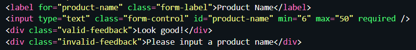

# Resume Kampus Merdeka ReactJS – Bootstrap
## 24 - 25 Agustus 2023

## 3 Poin Materi Bootstrap :
### - Apa itu Bootstrap

Bootstrap adalah salah satu dari beberapa FrontEnd Framework yang didalamnya berupa sekumpulan aturan kode atau dokumentasi yang bisa kita gunakan untuk mempermudah dalam membuat suatu tampilan website

### - Alasan Mempelajari Bootstrap :

1. Gratis
2. Mudah Dipelajari
3. Cepat
4. Mendukung Responsif

### - Cara Menggunakan Bootstrap :

1. Untuk dapat menggunakan bootstrap, dapat langsung menuju website bootstrap dan unduh secara langsung dl
https://getbootstrap.com/docs/5.1/getting-started/download/
2. Setelah mengunduh bootstrap, langkah selanjutnya adalah bisa dengan cara mempelajari example, ataupun mempelajari komponen-komponen yang ada ada bootstrap dl
https://qetbootstrap.com/docs/5.1/layout/containers/

---

## Latihan Bootstrap
### - Soal Prioritas 1
1. Gunakan komponent bootstrap seperti navbar untuk membuat navigation di LandingPage.html

2. Gunakan komponent bootstrap seperti button dan form di halaman CreateProduct.html

3. Buatlah halaman CreateProduct.html seperti gambar dibawah.

### - Soal Prioritas 2
1. Gunakan grid system dari BS ketika membuat CreateProduct.html.

2. Buatlah halaman memiliki validasi memanfaatkan BS

### - Soal Eksplorasi
1. Terapkan JavaScript plugin di bootstrap seperti Modal, Carousel, atau Tooltip di halaman CreateProduct.html/LandingPage.html . desain tidak ditentukan, kalian bebas menambahkan sesuai keinginan kalian.

2. Buat alert dengan bootstrap ketika validasi input form di CreateAccount.html salah

### ThankYou