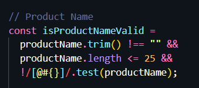
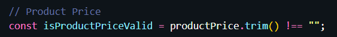
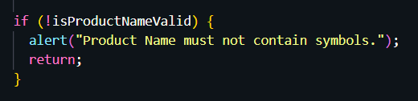
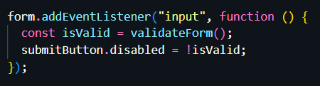
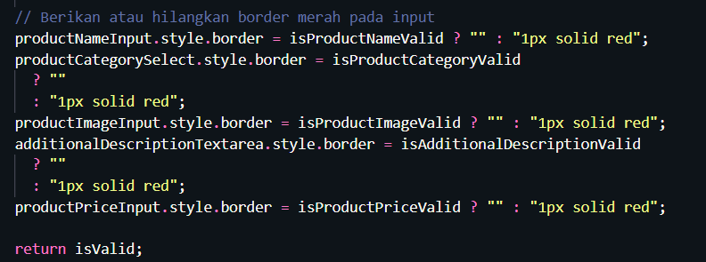
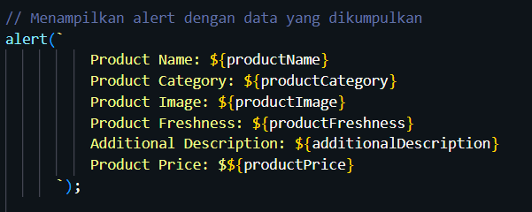

# Resume Kampus Merdeka ReactJS – Bootstrap
## 28 - 30 Agustus 2023

## 3 Poin Materi Javascript :
### - Apa itu Javascript

Javascript adalah salah satu bahasa pemograman tingkat tinggi atau high-level, diartikan high-level karena semakin tinggi level bahasa semakin mudah dipahami oleh manusia.

### - Beberapa fungsi penggunaan Javascript

1. Interaktivitas
2. Manipulasi DOM
3. Validasi Form
4. Komunikasi dengan server
5. Animasi
dll

### - Apa itu DOM

Document Object Model atau DOM adalah API untuk HTML yang merepresentasikan halaman web pada suatu dokumen menjadi sebuah object

---

## Latihan Javascript
### - Soal Prioritas 1

1. Product Name tidak boleh melebihi 25 karakter
2. Jika Product Name melebihi 25 karakter tambilkan pesan error atau peringatan/alert seperi "Last Name must not exceed 25 characters."

3. Product Name dan Product Price tidak boleh kosong. Jika field tersebut kosong saat tombol Submit/Create Product di tekan maka tampilkan alert atau error bahwa field tersebut tidak boleh kosong. Misal "Please enter a valid Prouct name.".

 | 

### - Soal Prioritas 2

1. Procut Name tidak boleh mengandung karakter seperti @/#{}

2. Jika Procut Name mengandung symbol @/#{} tampilkan pesan error atau peringatan misal "Name must not contain symbols."

3. Validasi input setiap form bahwa field tidak boleh kosong. Jika field kosong saat form dikirim maka tampilkan pesan error “The xxx field must be filled in”

### - Soal Eksplorasi

1. Buatlah script DOM JavaScript untuk menonaktifkan tombol Submit/Create Accountjika salah satu input tidak valid/salah/belum di isi.

2. Jika salah satu field tidak valid/salah berikan border merah atau tampilkan icon error pada field tersebut dengan JS DOM.

3. jika semua form telah diisi sesuai dengan falidasi dan user melakukan klik pada button Submit maka akan terdapat alert yang mengeluarkan setiap data.

