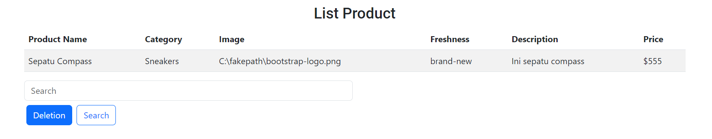
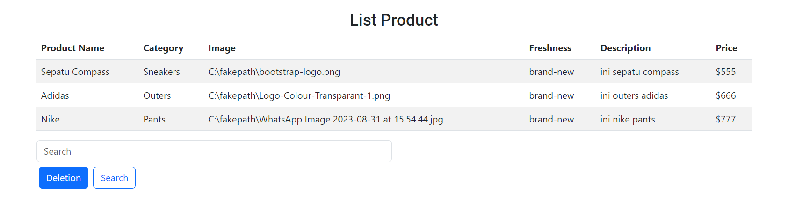
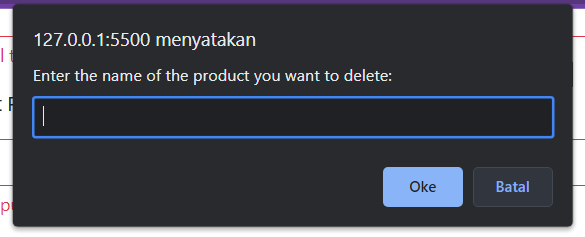
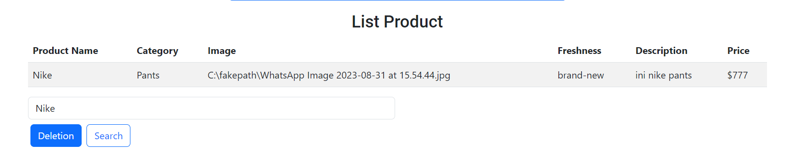

# Resume Kampus Merdeka ReactJS – Data Structure
## 31 Agustus - 1 September 2023

## 3 Poin Materi Data Structure :
### - Apa itu Data Structure 

Data adalah cakupan luas merujuk tipe semua tipe informasi yang tersimpan dalam memori komputer (string, number, boolean, dll). Data structure adalah bagaimana menyimpan dan mengorganisir data/value/elemen di dalam memori komputer. Data dapat dikelola dengan berbagai cara, diantaranya data dapat disimpan dalam  3 variable, data dtring dapat tersimpan dalam satu variable array.

### - Mengapa kita perlu belajar Data Structure 

Mempelajari data structures sangat dibutuhkan karena beberapa alasan, diantaranya untuk mengetahui kualitas kode yang dibuat dan juga efisiensi kode.

### - Basic Data Structure

#### 1. Array

Array merupakan data structure yang paling dasar dan juga serbaguna. Hal demikian disebabkan array dapat menampung elemen data dalam jumlah banyak dan memiliki indeks yang mengidentifikasi dimana posisi elemen berada. 

beberapa operasi :

- Reading

Reading merupakan operasi yang digunakan untuk melihat apa yang terkandung pada indeks tertentu di dalam array. Operasi reading juga merupakan operasi tercepat karena hanya membutuhkan 1 steps. Ketika membaca sebuah value pada indeks tertentu memori komputer dapat langsung melompat ke indeks tersebut.

- Searching

Searching digunakan untuk mencari apakah nilai tertentu ada di dalam array atau tidak, searching juga merupakan kebalikan dari operasi reading. Ketika melakukan operasi searching pada array komputer tidak memiliki cara untuk melompat langsung ke nilai tertentu karena komputer tidak bisa mengetahui begitu saja nilai apa yang terkandung pada setiap memori.

- Deletion

Operasi deletion merupakan operasi yang digunakan untuk menghilangkan value pada indeks tertentu. Operasi deletion membutuhkan jumlah N steps untuk array yang mengandung N data.

- Insertion

Operasi insertion pada javascript dapat efisien tergantung kita memasukkan valuenya, ketika kita memasukkan value pada akhir dari array hanya akan membutuhkan satu steps saja. Seperti contoh: Jika kita memiliki array dengan ukuran lima value dimulai dari alamat memori 1020, maka akhir alamat memorinya adalah 1024. Sehingga ketika kita menambahkan value barum berarti kita menambahkannya pada alamat memori berikutnya yaitu 1025. Dan ini hanya membutuhkan satu steps saja.

#### 2. Set

Data structure sama seperti array, tetapi perbedaanya hanya pada set yang tidak mengizinkan duplikat value dimasukkan kedalamnya. Dari ke-4 operasi reading, searching, insertion dan deleting terdapat perbedaan efisiensi pada operasi insertion. Sedangkan untuk operasi lainnya sama seperti array.

Operasi pada set :

- Reading : dapat menggunakan forEach
- Searching : dapat menggunakan has method
- Deletion : dapat menggunakan method delete()
- Insertion : perlu beberapa step tambahan untuk memastikan bahwa value yang ingin dimasukkan tidak ada di dalam set, setelah itu operasi searching akan dijalankan terlebih dahulu untuk melihat valuenya (operasi searching bisa mencapai N steps).

---

## 3 Poin Materi Data Structure :

### - Soal Prioritas 1 

Masukkan setiap data yang telah berhasil di validasi ke dalam tabel seperti gambar dibawah. 

### - Soal Prioritas 2 

Jumlah dari data akan selalu bertambah jika user terus mengisi form yang telah kalian buat.

### - Soal Eksplorasi

1. Buatlah tombol deletion(Delete) berfungsi. tombol deletion akan selalu menghapus nilai terakhir yang di masukkan oleh user. 

2. Buatlah tombol search berfungsi. tombol search akan mencari data dan menampilkan datanya pada alert berdasarkan username.

### ThankYou
