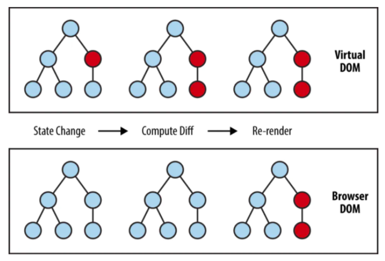

# Resume Kampus Merdeka ReactJS – Introduction React
## 5 - 6 September 2023

## 3 Poin Materi Introduction React :
### - Apa itu React 
React adalah Library Javascript untuk membuat User Interface (UI) yang interaktif dab cepat pada web maupun mobile. React merupakan library Open source yang di maintain oleh Facebook. Pada arsitektur MVC(Model-View-Controller), ReactJS hanya akan mengambil peran pada layer View saja.

### - Kenapa menggunakan React :
1. Declarative

Pendekatan di mana kita mendefinisikan apa yang ingin kita capai tanpa harus merinci langkah-langkah atau cara melakukannya secara eksplisit. Ini berarti kita menggambarkan "apa" yang kita inginkan, bukan "bagaimana" cara mencapainya.

2. Component Based (Berbasis Komponen)

 Di mana perangkat lunak dibangun dengan memecahnya menjadi bagian-bagian yang lebih kecil dan mandiri yang disebut "komponen." Setiap komponen adalah unit terpisah yang memiliki tugas dan tanggung jawab tertentu dalam aplikas.

3. Learn Once, Write Anywhere 

Kita hanya perlu mempelajari React lalu dapat kita gunakan di berbagai platform tanpa harus mempelajari kerangka kerja yang berbeda untuk setiap platform.

### - Virtual DOM

Adalah representasi dati UI berbentuk Javascript Object yang disimpan pada memori. Saat ada perubahan dalam data, React memperbarui VDOM terlebih dahulu, membandingkannya dengan VDOM sebelumnya, dan hanya menerapkan perubahan yang diperlukan ke DOM asli. Ini mengurangi manipulasi langsung pada DOM, yang dapat mempercepat pembaruan tampilan.

