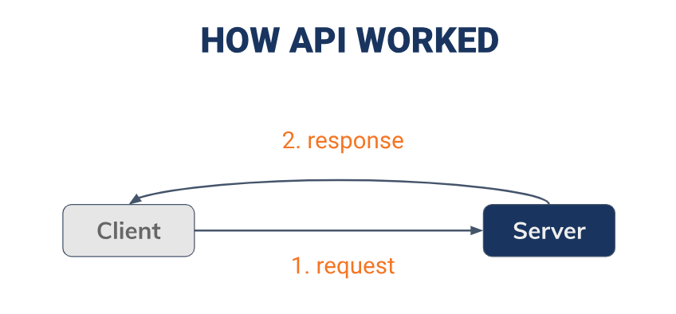
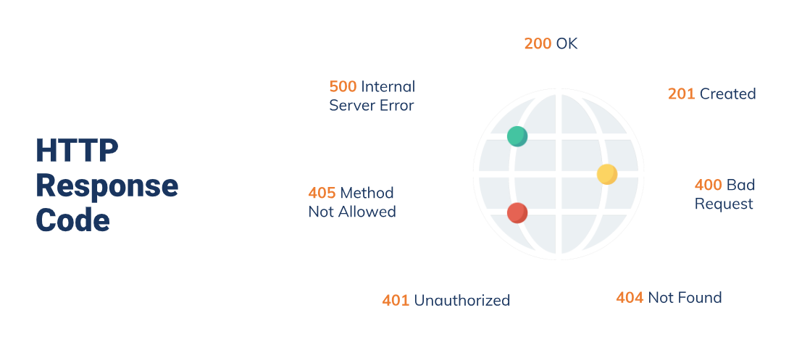

# Resume Kampus Merdeka ReactJS – Introduction Restfull API
## 2 - 3 Oktober 2023

## 3 Poin Introduction Restfull API :
### - Apa itu API

API (Application Programming Interface), Kata Aplikasi pada API merujuk pada perangkat lunak dengan fungsi yang berbeda. Kata Antarmuka dapat diartikan sebagai kontrak layanan antara dua aplikasi. Kontrak ini menjelaskan cara keduanya saling berkomunikasi dengan menggunakan permintaan (request) dan respons (response). Dokumentasi API keduanya berisi informasi cara developer menyusun permintaan dan respons tersebut.

Tujuan penggunaan API untuk mengintegrasikan perangkat lunak dengan layanan pihak ketiga, mengakses data dari server, mengontrol perangkat keras, dan banyak lagi. Mereka dapat digunakan dalam berbagai bahasa pemrograman dan lingkungan pengembangan.

### - Bagaimana API Bekerja

1. Request: aplikasi melakukan request ke API dengan tujuan untuk untuk mengakses data, melakukan operasi tertentu, atau mengirim data ke layanan tertentu dengan  protokol HTTP (seperti GET, POST, PUT, atau DELETE) dan berisi informasi seperti URL sumber daya yang diminta, jenis permintaan, dan data tambahan seperti parameter.
2. Proses di server: Proses ini bisa melibatkan akses ke database, komunikasi dengan layanan lain, atau operasi lain yang diperlukan.
3. Pemrosesan Permintaan: Server menghasilkan respons berdasarkan permintaan tersebut. Respons ini biasanya berisi data yang diminta atau hasil dari operasi yang dilakukan. Respons juga termasuk kode status HTTP yang mengindikasikan apakah permintaan berhasil atau gagal (misalnya, kode status 200 untuk berhasil, 404 untuk tidak ditemukan, atau 500 untuk kesalahan server).
4. Response: Server menghasilkan respons berdasarkan request yang dilakukan. Respons ini biasanya berisi data yang diminta atau hasil dari operasi yang dilakukan. Respons ini biasanya memiliki format data seperti JSON atau XML.

### - REST & JSON

1. REST (Representational State Transfer)

REST merupakan kepanjangan dari Representational State Transfer. REST mendefinisikan fungsi-fungsi seperti GET, PUT, DELETE, dll. yang dapat digunakan klien untuk mengakses data server. Klien dan server saling bertukar data dengan menggunakan HTTP

2. JSON (JavaScript Object Notation)

JavaScript Object Notation (JSON) adalah format berbasis teks yang bisa dipahami dan dibaca manusia serta dirancang untuk keperluan pertukaran data. JSON didukung oleh banyak bahasa pemrograman, environment, dan library.

###_ThankYou_