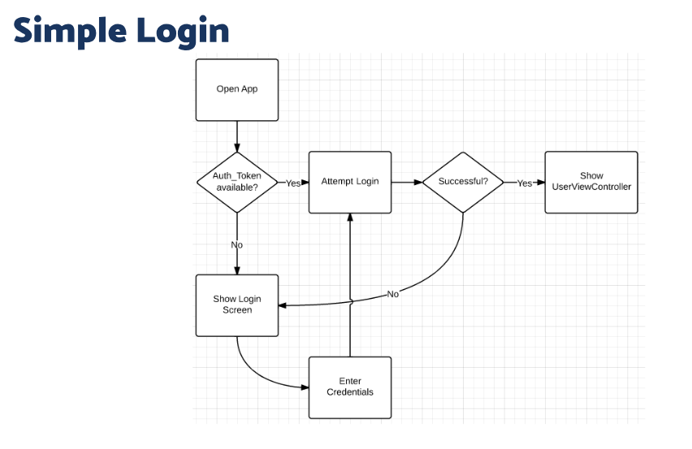

# Resume Kampus Merdeka ReactJS – Authentication in React
## 6 Oktober 2023

## 3 Poin Authentication in React :
### - Authentication

Autentikasi merupakan Fungsi menentukan hak akses/hak istimewa terhadap sumber daya, yang berkaitan dengan keamanan informasi umum dan keamanan komputer, dan kontrol akses pada khususnya. Secara lebih formal, "mengotorisasi" berarti mendefinisikan kebijakan akses.

#### Cara Kerja Authentication
- User melakukan registrasi terlebih dahulu(seperti mengisi username, password dan email)
- Server akan memberikan response sukses ketika user sudah berhasil registrasi.
- User aka melakukan proses login dengan memasukkan username dan password yang sudah dibuat
- Kemudian server akan mencocokan data yang kita kirim dengan database pengguna milik mereka. 
- Apabila data yang dimasukan cocok maka akses login akan langsung diberikan dan sistem akan mencatat aktivitas login kita. Tapi, apabila tidak ada kecocokan data, maka permintaan akses kita ditolak. 
- Kemudian jika kamu mencoba berulang kali biasanya akan terjadi blokir sementara karena dianggap sebagai aktivitas yang mencurigakan, seperti pembobolan akun.

### - Authorization 

Otorisasi adalah proses yang memutuskan apa yang diperbolehkan atau dilarang bagi pengguna atau entitas tertentu dalam sebuah sistem atau aplikasi setelah mereka berhasil melewati proses autentikasi. Dalam konteks sistem atau aplikasi, otorisasi mengontrol hak akses individu atau peran ke sumber daya dan fungsi yang berbeda. Ini berarti menentukan apa yang dapat dilakukan atau diakses oleh pengguna setelah mereka berhasil masuk atau autentikasi.

#### Cara Kerja Authorization
- Setelah pengguna berhasil melewati proses autentikasi, sistem atau aplikasi akan memiliki informasi tentang identitas pengguna tersebut.
- Selanjutnya, berdasarkan informasi tersebut, sistem akan menentukan hak akses atau izin yang dimiliki oleh pengguna. Izin ini biasanya didefinisikan sebelumnya dalam kebijakan keamanan atau manajemen hak akses.
- Setiap pengguna atau peran dalam sistem diberikan sejumlah izin atau hak akses tertentu yang mengatur akses mereka ke sumber daya atau fungsi dalam aplikasi atau sistem tersebut. Contoh izin bisa mencakup hak akses untuk membaca, menulis, mengedit, atau menghapus data tertentu.
- Ketika pengguna mencoba mengakses sumber daya atau menjalankan fungsi tertentu dalam aplikasi, sistem akan memeriksa izin yang dimilikinya.
- Jika pengguna memiliki izin yang sesuai untuk tindakan tersebut, akses akan diizinkan, dan pengguna dapat melanjutkan tindakan tersebut.
- Namun, jika pengguna tidak memiliki izin yang diperlukan, akses akan ditolak, dan pengguna akan diberikan pesan atau tindakan yang sesuai berdasarkan aturan otorisasi yang telah ditentukan.
- Sistem akan terus memantau dan memvalidasi izin selama pengguna tetap berinteraksi dengan aplikasi atau sistem.

### - Login dalam React

Dalam keamanan komputer, login adalah proses di mana seseorang memperoleh akses ke sistem komputer dengan mengidentifikasi dan mengautentikasi dirinya sendiri.

### _ThankYou_